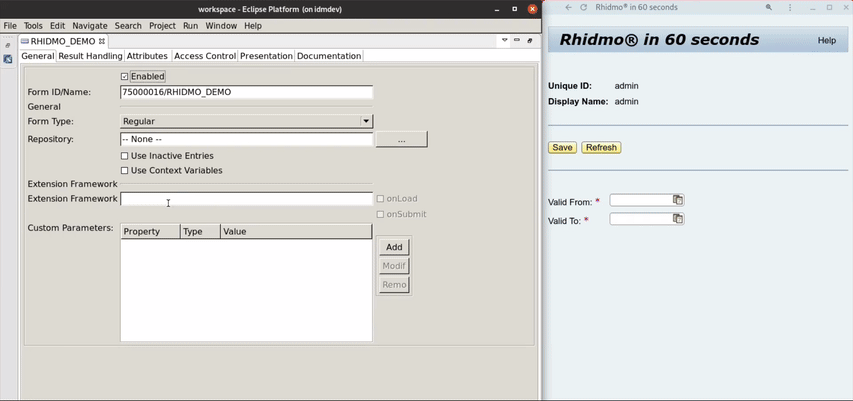

# Rhidmo&reg;
Developing JavaScript-based extensions for [SAP&reg; Identity Management (IDM) 8.0](https://www.sap.com/products/identity-management.html)

## Why would I need it?

Rhidmo&reg; is a generic implementation of the SAP&reg; Identity Management Extension Framework. It enables developers to build custom SAP&reg; IDM extensions in JavaScript instead of Java, directly from SAP&reg; Identity Management Developer Studio. The most common use cases for such extensions are
* calculating UI fields on load
* validating user input on submit
* showing custom error messages

Rhidmo&reg; is free and open source software available under the [Apache License, Version 2.0](https://www.apache.org/licenses/LICENSE-2.0.txt). Its maintainers provide non-commerical community support for Rhidmo&reg; on a best-effort basis. If you encounter any problems, please create a GitHub issue in this repository. Commercial maintenance contracts or support options do not exist at this time.

## Download Rhidmo Binaries
For users who do not wish to build Rhidmo from source, each official Rhidmo release is available for download as a ZIP archive. This ZIP contains:
* the compiled Rhidmo EAR for deployment on SAP® NetWeaver
* the Rhidmo installation manual in PDF format
* optional SAP® Identity Management packages with Rhidmo demo content

The single official distribution channel for Rhidmo binary release ZIP archives is here on GitHub on our [releases page](https://github.com/foxysoft/idm-extension-rhidmo/releases/). We recommend always using the **latest** Rhidmo release for production. It's available from the following stable link:

https://github.com/foxysoft/idm-extension-rhidmo/releases/latest

## Build Rhidmo from Source
See our separate [BUILD](BUILD.md) documentation for detailed instructions on how to build Rhidmo binaries from source or verify the integrity of Rhidmo binaries you have downloaded from GitHub.

## Deploy Rhidmo Binaries
For a detailed installation and configuration guide, please refer to docs/InstallationManual.pdf contained in this distribution. Here's a condensed summary:

Copy rhidmo-ear-&lt;VERSION&gt;.ear to your SAP&reg; NetWeaver host, and use a local telnet connection to deploy.

Assuming UNIX-like build environment (local) and SAP&reg; NetWeaver host (remote), use these shell commands to deploy directly from the project's root directory:

    scp ear/target/*.ear root@your-sap-jee-host:/tmp
    ssh root@your-sap-jee-host
    telnet localhost 50008
    deploy /tmp

Adjust host name and JEE telnet port according to your environment.
    
